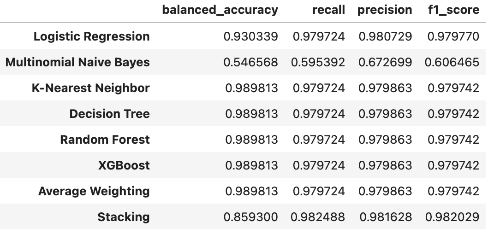

# Customer-Segmentation-in-E-Commerce

## Contents:
- [Problem Statement](#Problem-Statement)
- [Software Requirements](#Software-Requirements)
- [Notebook Descriptions](#Notebook-Descriptions)
- [Data Dictionary](#Data-Dictionary)
- [Data Cleaning](#Data-Cleaning)
- [RFM Analysis](#RFM-Analysis)
- [Model Building](#Model-Building)
- [Conclusions and Recommendations](#Conclusions-and-Recommendations)

## Problem Statement
In the fast-paced world of e-commerce, understanding customer behavior is the key to success. Our project aims to transform the raw data into actionable insights by segmenting customers based on their purchasing behavior. Our data playground is the [Online Retail Dataset](https://archive-beta.ics.uci.edu/dataset/352/online+retail), a rich dataset detailing the transactions occurring for a UK-based and registered, non-store online retail.

Our strategy is to use clustering algorithms to group registered customers exhibiting similar behaviors in terms of Recency, Frequency, and Monetary values. We will assess the effectiveness of this approach using metrics such as the silhouette score and cluster inertia. Through this segmentation, we can devise and implement strategies that are custom-tailored to the unique characteristics of each customer group.

Subsequently, we will employ a variety of classification models to predict the future behavior of our customers based on their cluster labels. The balanced accuracy metric will be used to compare the performance of these models. Finally, we will apply a traditional Time Series model to forecast future weekly gross sales for all customers. This comprehensive approach allows us to better understand our current customer behavior, predict future actions, and drive more targeted marketing strategies.

## Software Requirements
- Pandas
- Scikit-learn
- numpy
- matplotlib.pyplot
- seaborn
- plotly
- math
- xgboost
- scipy
- warnings
- statsmodels
- pmdarima
- kaleido

## Notebook Descriptions
|File Name|Description|
|---|---|
|**[1_Data_Cleaning.ipynb](https://github.com/blueran21/Customer-Segmentation-in-E-Commerce/blob/main/code/1_Data_Cleaning.ipynb)**|Data Cleaning|
|**[2_EDA.ipynb](https://github.com/blueran21/Customer-Segmentation-in-E-Commerce/blob/main/code/2_EDA.ipynb)**|Exploratory Data Analysis|
|**[3_RFM_Analysis.ipynb](https://github.com/blueran21/Customer-Segmentation-in-E-Commerce/blob/main/code/3_RFM_Analysis.ipynb)**|Recency, Frequency and Monetory Analysis|
|**[4_Customer_Classification.ipynb](https://github.com/blueran21/Customer-Segmentation-in-E-Commerce/blob/main/code/4_Customer_Classification.ipynb)**|Applying variations of classification models and evaluating models performance|
|**[5_GrossSales_Forcasting.ipynb](https://github.com/blueran21/Customer-Segmentation-in-E-Commerce/blob/main/code/5_GrossSales_Forcasting.ipynb)**|Forecasting weekly gross sales|

## Data Dictionary
|Feature|Type|Dataset|Description|
|---|---|---|---|
|**InvoiceNo**|object|Online Retail.xlsx|Unique number assigned to each transaction. If this code starts with letter 'C', it indicates a cancellation|
|**StockCode**|object|Online Retail.xlsx|Product code|
|**Description**|object|Online Retail.xlsx|Product name|
|**Quantity**|int|Online Retail.xlsx|The quantities of each product per transaction|
|**InvoiceDate**|Datetime64|Online Retail.xlsx|The day and time when each transaction was generated|
|**UnitPrice**|float|Online Retail.xlsx|Product price per unit in sterling|
|**CustomerID**|float|Online Retail.xlsx|Unique Customer ID|
|**Country**|object|Online Retail.xlsx|The name of the country where each customer resides|
|**InvoiceNo**|int|cleaning_data.csv|Unique number assigned to each transaction|
|**StockCode**|object|cleaning_data.csv|Product code|
|**Description**|object|cleaning_data.csv|Product name|
|**Quantity**|int|cleaning_data.csv|The quantities of each product per transaction|
|**InvoiceDate**|object|cleaning_data.csv|The day and time when each transaction was generated|
|**UnitPrice**|float|cleaning_data.csv|Product price per unit in sterling|
|**CustomerID**|int|cleaning_data.csv|Unique Customer ID|
|**Country**|object|cleaning_data.csv|The name of the country where each customer resides|
|**CancelledQuantity**|int|cleaning_data.csv|The quantities of each product cancelled per transaction|
|**recency**|int|customer_seg.csv|The number of days between the customer's latest order date and the maximum invoice date in the dataset|
|**frequency_item**|int|customer_seg.csv|The total number of unique items across all orders|
|**frequency_order**|int|customer_seg.csv|The total number of orders|
|**monetary**|float|customer_seg.csv|The total revenue generated by each customer|
|**cluster_seq**|int|customer_seg.csv|The cluster label of each customer|

## Data Cleaning
In the dataset, we encounter two columns - "Description" and "CustomerID" - that contain missing values after removing duplicated transactions. Given that we cannot reasonably infer missing "CustomerID" values - perhaps these visitors have not registered or logged into the website - we've decided to remove these rows. Our analysis will then concentrate on customers who have logged in and are identifiable via the website. However, Recognizing that non-registered customers also significantly contribute to the company's sales, we will include all customers in the final steps of forecasting future weekly gross sales. This inclusion ensures that our forecast is comprehensive and represents all potential revenue streams for the company. Finally, we addressed all cancelled transactions by removing them and marking the corresponding previous order transactions (as per the assumptions outlined in the notebook). We added a new column named "Cancelled Quantity" to systematically record information related to these cancelled orders.

## RFM Analysis
RFM is a commonly used method for segmentation in retail. 'Recency' is how recently a customer has made a purchase, 'Frequency' is how often they purchase, and 'Monetary Value' is how much they spend. We have derived corresponding columns and employed the K-means algorithm to create these customer segments. In my analysis, the silhouette score is highest at 2, suggesting that clusters optimally separate the data. On the other hand, the elbow method suggests that adding clusters up to 8 continues to significantly improve the within-cluster sum of squares(inertia). Therefore, we consider two clusters as a high-level separation and the 8-cluster solution provides more granular, specific segmentation and use 8 clusters as the label for future classification.

## Model Building
#### Customer Classification

The results from various machine learning models for customer classification indicate a high level of performance across the board, with certain models delivering superior results. Given that this is a multi-classification problem with class imbalances, the balanced accuracy metric was prioritized in evaluating model performance.

- Logistic Regression: This model achieved solid results, with a balanced accuracy of 93.03%, which is impressive given the unbalanced nature of the classification problem. The recall was 97.97%, precision 98.07%, and F1 score 97.98%, all reflecting the model's overall good performance.

- Multinomial Naive Bayes: The balanced accuracy for this model was relatively moderate at 54.66%, suggesting that it struggled to handle the class imbalance in the data. Other metrics also showed moderate results with a recall of 59.54%, precision of 67.27%, and an F1 score of 60.65%.

- K-Nearest Neighbor, Decision Tree, Random Forest, XGBoost, and Average Weighting: These models all demonstrated outstanding performance with a balanced accuracy of 98.98%, indicating their superior ability to correctly classify customers into their respective clusters even in the presence of class imbalance. All these models achieved a recall of 97.97%, precision of 97.99%, and an F1 score of 97.97%.

- Stacking: The stacked model achieved a balanced accuracy of 85.93%, which is lower compared to the K-Nearest Neighbor, Decision Tree, Random Forest, XGBoost, and Average Weighting models. This suggests that while stacking multiple models can improve performance, it might not always provide the best solution when dealing with imbalanced data. Despite its lower balanced accuracy, the model's recall was 98.25%, precision 98.16%, and the F1 score was 98.20%, reflecting overall good performance.

#### Gross Sales Time Series
- ARIMA
- SARIMA

## Conclusions and Recommendations
In conclusion, while all models showed high predictive performance, the K-Nearest Neighbor, Decision Tree, Random Forest, XGBoost, and Average Weighting models delivered the highest balanced accuracy. These models, thus, appear to be particularly well-suited for handling class imbalances and represent strong choices for this task. Meanwhile, the stacking model's balanced accuracy, though good, was not superior to these models.